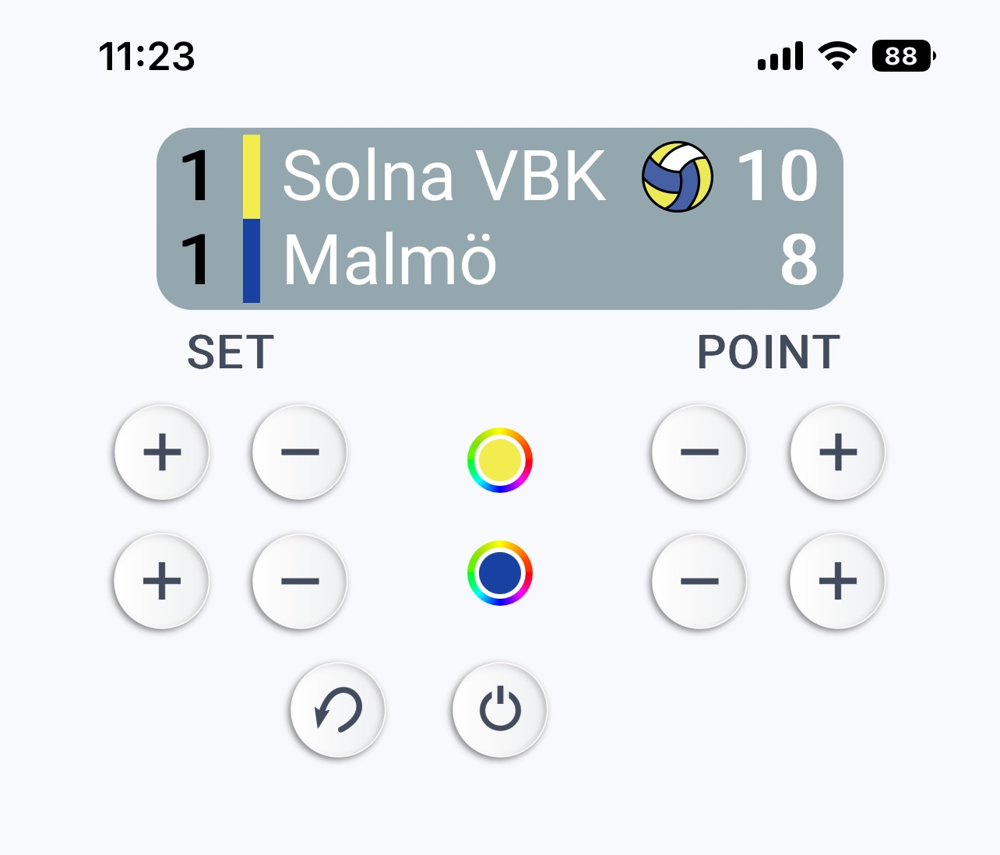
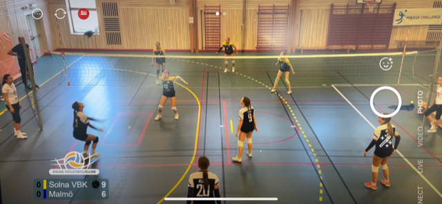

# Scoreboard Controller and Overlay

A simple web-based scoreboard application designed for volleyball games. It provides a controller interface for updating scores and an overlay that can be used in streaming software. The app supports undo/redo, team names, colors, and position adjustments.



## Features

- Real-time score updates
- Undo/redo functionality
- Customizable team names and colors
- Adjustable scoreboard position
- Simple overlay for streaming

## Installation

You have two options to run the scoreboard: using Apache with PHP or a standalone Python server.

### Option 1: Apache with PHP

1. Copy the contents of the `html/` directory to your web server.
2. Ensure PHP is enabled on your server.
3. Access the controller at `scoreboard.html` and the overlay at `index.html`.

### Option 2: Python Server (Recommended for Simple Setup)

1. Ensure you have Python 3 installed.
2. Run the server:
   ```bash
   cd /path/to/scoreboard
   python server.py
   ```
3. The server will start on port 8081.
4. Access the controller at `http://localhost:8081/scoreboard.html`
5. Access the overlay at `http://localhost:8081/index.html`

For public access (e.g., during games), you can port forward port 8081 from your router to your local machine.

## Security

The scoreboard includes basic security measures to prevent unauthorized access:

- **Token Authentication**: All updates require a valid token to prevent tampering.
- **File Restrictions**: Only `scoreboard.xml` can be updated via the upload endpoint.

### Token Setup

1. Choose a strong, random token (e.g., 32-character hexadecimal string).
2. Update the `TOKEN` variable in the following files with your chosen token:
   - `server.py` (for Python server)
   - `html/scoreboard.js` (for the controller)
   - `html/upload.php` (for Apache/PHP setup)
3. Keep the token secret. 

## Usage

- **Controller**: Use `scoreboard.html` to update scores, team names, and settings from any web browser. Usually a phone during the game you are scoring.
- **Overlay**: Use `index.html` in your streaming software. It automatically updates every second.

## Requirements

- Python 3 (for Python server option)
- Web browser with JavaScript enabled
- PHP (for Apache option)

## Contributing

Feel free to submit issues or pull requests for improvements.


