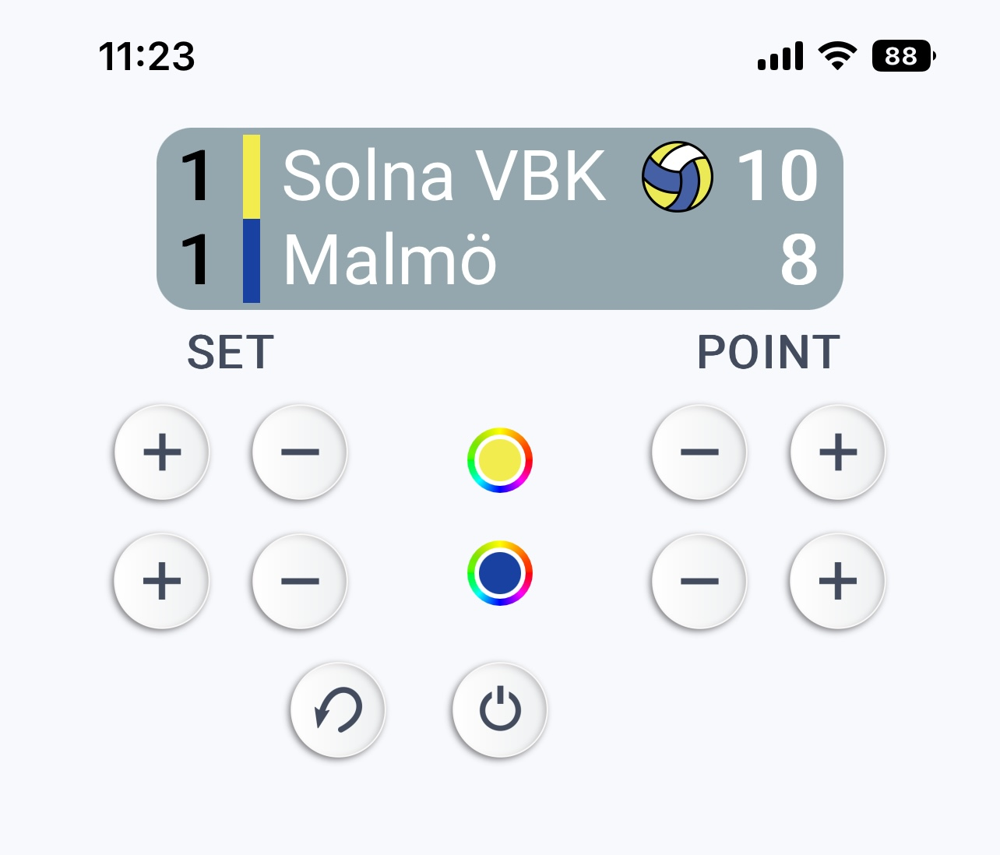

# Scoreboard Controller and Overlay

A multi-user web-based scoreboard application designed for volleyball games. It provides a controller interface for updating scores, automated scraping from Profixio match pages, stats generation, and an overlay that can be used in streaming software.



## Features

- **Multi-user support**: Each user has isolated data and can run independent scrapers
- **Automated scraping**: Fetch live scores from Profixio match URLs
- **Manual control**: Real-time score updates with undo/redo functionality
- **Stats generation**: Automatic player statistics from match data
- **Customizable**: Team names, colors, and position adjustments
- **Streaming overlay**: Simple overlay for OBS/vMix integration
- **Secure**: Session-based authentication with rate limiting

## Installation

### Prerequisites

Install required Python packages:
```bash
pip install flask waitress requests beautifulsoup4 lxml werkzeug
```

Python must provide `hashlib.pbkdf2_hmac` for password generation and login.
On Python 3.12 and later, this requires working OpenSSL support (see
[Python's hashlib documentation](https://docs.python.org/3/library/hashlib.html#hashlib.pbkdf2_hmac)).

### Setup

1. **Clone the repository**:
   ```bash
   git clone https://github.com/yourusername/scoreboard.git
   cd scoreboard
   ```

2. **Create a user account**:
   ```bash
   # Generate a password hash
   python3 generate_password.py your_password_here
   
   # Copy the output hash
   # Edit users.json (copy from users.json.example)
   ```

3. **Configure users.json**:
   ```json
   {
     "users": {
       "yourusername": {
         "password_hash": "pbkdf2:sha256:1000000$...",
         "token": "your-random-token-here",
         "display_name": "Your Name"
       }
     }
   }
   ```

4. **Set session secret** (production):
   ```bash
   export SCOREBOARD_FLASK_SECRET=$(python3 -c 'import secrets; print(secrets.token_hex(32))')
   ```

5. **Run the server**:
   ```bash
   python3 server.py
   ```

6. **Access the application**:
   - Login: http://localhost:8081/login
   - Control panel: http://localhost:8081/yourusername/control
   - Manual scoreboard: http://localhost:8081/yourusername/scoreboard.html
   - Overlay: http://localhost:8081/yourusername/overlay/

## Troubleshooting

### Login fails with `hashlib` has no attribute `pbkdf2_hmac`

This means the Python interpreter running Scoreboard lacks the password-hashing
function used by Werkzeug. On Python 3.12+, missing or unloadable OpenSSL support
can cause this. The generated session-secret warning is unrelated.

On Alpine Linux, update Python and its OpenSSL libraries from your configured
repositories as root, then check that password hashing works:

```sh
apk update
apk add --upgrade python3 libcrypto3 libssl3
python3 -c 'import hashlib; hashlib.pbkdf2_hmac("sha256", b"test", b"salt", 1); print("PBKDF2 OK")'
```

If the check prints `PBKDF2 OK`, restart `python3 server.py` and log in using your
existing password. No changes to `users.json` are needed. Scoreboard checks for
this missing function at startup, including when imported by a WSGI server;
the password generator also reports how to repair the runtime.

If the check still fails, run these diagnostics with the same interpreter used
to start the server:

```sh
python3 -c 'import sys, hashlib; print(sys.executable); print(sys.version); print(hashlib.__file__)'
python3 -c 'import _hashlib'
apk policy python3 libcrypto3 libssl3
```

The `_hashlib` import exposes missing libraries or incompatible symbols that
`hashlib` can hide. If packaged files are missing or damaged, reinstall them with
`apk fix python3 libcrypto3 libssl3`, then rerun the check. A custom-built Python
needs to be rebuilt with OpenSSL support or replaced with Alpine's packaged
interpreter. A local file named `hashlib.py` can also shadow the standard library;
the diagnostic path above helps identify that case.

See [Alpine's package-management documentation](https://wiki.alpinelinux.org/wiki/Alpine_Package_Keeper)
for package repair commands. On other systems, repair the corresponding Python
and OpenSSL packages or use a Python build with working OpenSSL support.

## Security

⚠️ **Important**: Read [SECURITY.md](SECURITY.md) before deploying to production.

**Built-in protections**:
- ✅ Rate limiting (5 failed logins per IP per 5 minutes)
- ✅ Password hashing (pbkdf2:sha256)
- ✅ Session-based authentication
- ✅ User data isolation
- ✅ Upload size limits (5MB)
- ✅ Auto-generated session secrets

**For production deployment**:
- Use HTTPS (reverse proxy with nginx/Apache)
- Set `SCOREBOARD_FLASK_SECRET` environment variable
- Run behind firewall or VPN
- Keep `users.json` private (already in .gitignore)

## Version History

### v2.0.0 (Multi-User) - Current Development
The current version includes multi-user support with enhanced security features.

### v1.2.8 (Single-User) - Stable Release
If you don't need multi-user support, **v1.2.8** is a simpler, stable single-user option.

To use v1.2.8:
```bash
git checkout v1.2.8
# Follow the simpler setup instructions in that version's README
```

**Migrating from v1.2.8 to v2.0.0:**
1. Create `users.json` from `users.json.example` with your username and hashed password
2. Move existing `scoreboard.xml` to `data/<username>/scoreboard.xml`
3. Update any bookmarks or OBS browser sources to include `/<username>/` in the path
4. Remove old `PAGE_PASSWORD` and token-based authentication code

See [CHANGELOG.md](CHANGELOG.md) for detailed changes.

## Usage

- **Control Panel**: Start/stop scraper, generate stats, navigate to manual scoring
- **Manual Scoreboard**: Update scores, team names, and settings from any web browser (typically a phone during games)
- **Overlay**: Add to OBS/vMix using the overlay URL - updates automatically

## Requirements

- Python 3.7+
- Flask, Waitress, Requests, BeautifulSoup4, lxml, Werkzeug
- Web browser with JavaScript enabled

## Contributing

Feel free to submit issues or pull requests for improvements.


